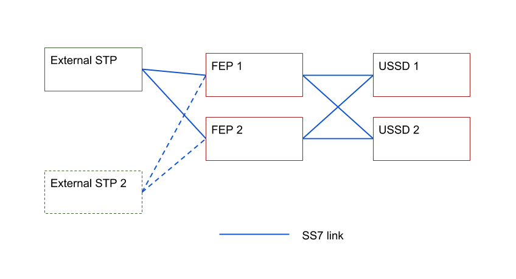

= Configuring
:doctype: book
:sectnums:
:toc: left
:icons: font
:experimental:
:sourcedir: .

You must fine-tune Memory and Database settings for better performance before using {this-platform} {this-application} in production.
Once you complete setting up the Gateway you must configure the SS7 Stack, USSD routing rules and USSD paramters. {this-platform} {this-application} comes with a convenient user-friendly Graphical User Interface (GUI) and a Command Line Interface (CLI) that will allow you to configure, monitor and manage the Gateway.
While the CLI tool allows complete configuration and control of the Gateway, the GUI-based management enhances the usability of the Gateway and gives you the ability to configure and manage the USSD Gateway dynamically.
This chapter will explain how to manage the Gateway effectively using both the GUI and the CLI. 

== Memory Settings (JBOSS 5)

You should fine tune the JVM memory settings based on your needs but we recommend you allocate a minimum of 3 GB for initial and maximum heap size.
These settings are specified in the file[path]_{this-folder}-ussdgateway-/jboss-5.1.0.GA/bin/run.conf_. 

-Xms3072m::
  Initial heap size, set in megabytes

-Xmx3072m::
  Maximum heap size, set in megabytes

== Memory Settings (Wildfly)

You should fine tune the JVM memory settings based on your needs but we recommend you allocate a minimum of 3 GB for initial and maximum heap size.
These settings are specified in the file[path]_{this-folder}-ussdgateway-/wildfly-10.1.0.Final/bin/standalone.conf_. 

-Xms3072m::
  Initial heap size, set in megabytes

-Xmx3072m::
  Maximum heap size, set in megabytes

[[_active_active]]
== Configuring of SS7 Active-Active mode with {this-platform} SS7 FEP before SS7 network

.Note
[NOTE]
====
SS7 Active-Active mode is a Telscale feature, available only in our commercial version.
====

This chapter introduces a description how Telestax USSD GW Active-Active can be configured. See below an example of a configuration with 2 FEP and 2 USSD GW nodes.

Two USSD GWs ("USSD 1" and "USSD 2") can be deployed at different physical servers (server 1 and server 2). Front-End-Processors ("FEP 1" and "FEP 2") plays a role of SS7 load balancers. "FEP 1" and "FEP 2" can be deployed to same physical servers as "USSD 1" and "USSD 2" (server 1 and server 2). "FEP 1" and "FEP 2" are connected by SS7 links to remote STP node(s).

A remote originated TCAP dialogs are loadshared by FEP nodes between existing USSD nodes. Then FEP nodes are responsible for resending of TCAP dialog messages to a proper USSD node. This guarantees that all SS7 dialogs will be processed by a same USSD GW node and USSD GW nodes does not demand processing of SS7 dialogs from another node. This means that USSD GW nodes still process messages independently. FEP nodes are needed to delivery of SS7 messages to a proper USSD GW node.

When you use several FEP / USSD GW nodes in a way that is described at a picture you can turn off any of FEP / USSD GW node for maintanance or for other reasons. All traffic then will be processed by alive nodes.

USSD GW supports of a graceful shutdown procedure. See more in a chapter <<_gsd_settings>>. A graceful shutdown procedure is initiated by a GUI / CLI interface. USSD GW will make a server shutdown when all USSD dialogs have completed. FEP nodes will prevent of sending new dialogs to a SS7 node that is gracefully shutting down. USSD GW node even after a graceful shutdown start will aceept and process of new incoming dialogs from application interfaces (HTTP, SIP). A user must stop of initiating of new dialogs via these interfeces before of a graceful shutdown start.

We need to make special configuring procedures of SS7 part before USSD GW / FEP will be able to work in a load-balancing mode. This configuring is described in a manual "Restcomm Load Balancer User Guide", check a chapter "Integration Load Balancer SS7 (FEP) with USSD and SMSC servers".

== CDR Logging Settings

Every transaction in the {this-platform} {this-application} is logged either in a Textfile or a Database as per the configuration.
By default, transactions are logged in a plain text file.
Alternatively, you can choose to have CDR logged in a Database instead of a plain text file.
You will find instructions for both in the sections below. 

If you change the configuration to log CDR in a Database, then you must be aware that transactions are logged into the default Database HSQLDB that comes bundled with JBoss AS and leverages the JBoss AS DataSource.
However this is only made available to allow the platform to run "out of the box". You must configure a production ready Database prior to using the Gateway in a production environment. {this-platform} {this-application} has been tested with PostgreSQL and MySQL.
 

To switch between Database and plain text file, you can make use of the CLI command `ussd set cdrloggingto <Database|Textfile>` or configure this in the GUI.
Refer to  <<_set_cdrlogging>> for more details.

WARNING: HSQLDB must not be used in a production environment.
You must ensure that you delete this datasource and configure a production-friendly Database like PostgreSQL or MySQL.

[[_configure_datasource]]
=== Configuring an Alternate DataSource (JBOSS 5)

The example HSQLDB DataSource is bound to the JNDI name java:/DefaultDS and its descriptor is available in the file [path]_{this-folder}-ussdgateway/jboss-5.1.0.GA/server/<profile>/deploy/hsqldb-ds.xml_.
You must delete this datasource and configure the Platform to use your choice of Database.
For instructions on configuring an alternate DataSource with an example, please refer to <<_configuring_mysql>>.
For detailed instructions and explanation please refer to the JBoss AS Getting Started Guide available https://community.jboss.org/wiki/JBossAS5InstallationAndGettingStartedGuide[here].
You will also find a lot of examples in the folder [path]_{this-folder}-ussdgateway/jboss-5.1.0.GA/docs/examples/jca/_. 

[[_configure_jslee_jdbc_ra]]
=== Configuring JSLEE JDBC RA (JBOSS 5)

{this-platform} {this-application} leverages JSLEE JDBC RA for persistence.
Detailed JSLEE JDBC RA documentation is available in [path]_{this-folder}-ussdgateway/docs/slee/Mobicents_SLEE_RA_JDBC_User_Guide.pdf_ that explains how to point to the new DataSource.
An example configuration is explained in this admin guide in the section <<_configuring_mysql>>.
When you have completed configuring an alternate DataSource in JBoss AS, you can proceed to modify JSLEE configurations accordingly.
You must change the Dialect in the file [path]_{this-folder}-ussdgateway/jboss-5.1.0.GA/server/<profile>/deploy/{this-folder}-slee/META-INF/jboss-beans.xml_ to reflect your alternate DataSource. 

[[_configure_datasource_wildfly]]
=== Configuring an Alternate DataSource (Wildfly)

HSQLDB DataSource is configured in [path]_{this-folder}-ussdgateway/standalone/configuration/standalone.xml in
"urn:jboss:domain:datasources:4.0" subsystem.
You must delete this datasource and configure the Platform to use your choice of Database.
For instructions on configuring an alternate DataSource with an example, please refer to <<_configuring_mysql-wildfly>>.
For detailed instructions and explanation please refer to Wildfly 10 documentation available https://docs.jboss.org/author/display/WFLY10/DataSource+configuration[here].
You will also find a lot of examples in the folder [path]_{this-folder}-ussdgateway/wildfly-10.1.0.Final/docs/examples/configs/_. 

[[_configure_jslee_jdbc_ra_wildfly]]
=== Configuring JSLEE JDBC RA (Wildfly)

{this-platform} {this-application} leverages JSLEE JDBC RA for persistence.
Detailed JSLEE JDBC RA documentation is available in [path]_{this-folder}-ussdgateway/docs/resources/jdbc/user-guide/en-US/pdf/JAIN_SLEE_JDBC_RA_User_Guide.pdf_ that explains how to point to the new DataSource.
An example configuration is explained in this admin guide in the section <<_configuring_mysql-wildfly>>.
When you have completed configuring an alternate DataSource, you can proceed to modify JSLEE configurations accordingly.

[[_table_structure]]
=== CDR Table Structure

----

CREATE TABLE USSD_GW_CDRS (ID VARCHAR(150) NOT NULL, L_SPC INT, L_SSN SMALLINT, L_RI SMALLINT, L_GT_I SMALLINT, L_GT_DIGITS VARCHAR(18), R_SPC INT, R_SSN SMALLINT, R_RI SMALLINT, R_GT_I SMALLINT, R_GT_DIGITS VARCHAR(18), SERVICE_CODE VARCHAR(50), OR_NATURE SMALLINT, OR_PLAN SMALLINT, OR_DIGITS VARCHAR(18), DE_NATURE SMALLINT, DE_PLAN SMALLINT, DE_DIGITS VARCHAR(18), ISDN_NATURE SMALLINT, ISDN_PLAN SMALLINT, ISDN_DIGITS VARCHAR(18), VLR_NATURE SMALLINT, VLR_PLAN SMALLINT, VLR_DIGITS VARCHAR(18), IMSI VARCHAR(100), STATUS VARCHAR(30) NOT NULL , TYPE VARCHAR(30) NOT NULL , TSTAMP TIMESTAMP NOT NULL , LOCAL_DIALOG_ID BIGINT, REMOTE_DIALOG_ID BIGINT, DIALOG_DURATION BIGINT, USSD_STRING VARCHAR(255), PRIMARY KEY(ID,TSTAMP));

where

ID : Primary unique key 

L_SPC : Local Signaling Pointcode 

L_SSN : Local Subsystem Number 

L_RI : Local Routing Indicator

L_GT_I : Local Global Title Indicator whose values are 
NO_GLOBAL_TITLE_INCLUDED(0)
GLOBAL_TITLE_INCLUDES_NATURE_OF_ADDRESS_INDICATOR_ONLY(1)
GLOBAL_TITLE_INCLUDES_TRANSLATION_TYPE_ONLY(2)
GLOBAL_TITLE_INCLUDES_TRANSLATION_TYPE_NUMBERING_PLAN_AND_ENCODING_SCHEME(3)
GLOBAL_TITLE_INCLUDES_TRANSLATION_TYPE_NUMBERING_PLAN_ENCODING_
					     SCHEME_AND_NATURE_OF_ADDRESS(4)

L_GT_DIGITS : Local Global Title Digits

R_SPC : Remote Signaling Pointcode 

R_SSN : Remote Subsystem Number 

R_RI : Remote Routing Indicator

R_GT_I : Remote Global Title Indicator

R_GT_DIGITS : Remote Global Title Digits

SERVICE_CODE : The short code dialed by user, for example *519#

OR_NATURE : AddressNature of origination
If the MAP Dialog carries Originating Address Reference this is captured in this column
Possible values are:
unknown(0), international_number(1), national_significant_number(2), network_specific_number(3), 
subscriber_number(4), reserved( 5), abbreviated_number(6) and reserved_for_extension(7)

OR_PLAN : Numbering Plan of origination. 
Possible values are:
unknown(0), ISDN(1), spare_2(2), data(3), telex(4), spare_5(5), land_mobile(6), 
spare_7(7), national(8), private_plan(9), reserved(15);

OR_DIGITS : Digits of origination

DE_NATURE : AddressNature of Destination 

DE_PLAN : Numbering Plan of Destination 

DE_DIGITS : Digits of destination

ISDN_NATURE : AddressNature 
The incoming MAP Dialog carries ISDN Address of mobile that dialed this shortcode.
The column ISDN_NATURE captures ISDN details.

ISDN_PLAN : Numbering Plan as explained above 

ISDN_DIGITS : Digits of MSISDN

VLR_NATURE : AddressNature
If MAP version is Ericsson MAP (E-MAP), it carries VLR address and IMSI

VLR_PLAN : Numbering Plan as explained above 

VLR_DIGITS : Digits of VLR

IMSI : IMSI

STATUS : Final status of Dialog. Possible values are explained below: 

TYPE : If the USSD request is pull, its value is PULL or its PUSH

TSTAMP : Time stamp when this request was executed

LOCAL_DIALOG_ID : Local Transaction Id of TCAP Dialog

REMOTE_DIALOG_ID : Remote Transaction Id of TCAP Dialog

DIALOG_DURATION : TCAP Dialog duration in milliseconds

USSD_STRING : String of USSD reponses from User
----

Status : Final status of Dialog can be   

SUCCESS::
  Dialog ended successfully

FAILED_INVOKE_TIMEOUT::
  Invoke (TCAP) sent from USSD Gateway to peer timed out.
   

FAILED_DIALOG_TIMEOUT::
  Dialog (TCAP) timed out as there is no activity on Dialog.
  The default dialog timeout is 60 seconds which can be configured on TCAP stack.
   

FAILED_APP_TIMEOUT::
  Request sent by USSD Gateway to Application timed out.
  Application took longer than configured `dialogtimeout`.
   

FAILED_CORRUPTED_MESSAGE::
  Message received by USSD Gateway from HTTP/SIP Application is corrupted.
  Usually this will also create some ERROR traces in server.log 

FAILED_TRANSPORT_ERROR::
  Used only for SIP transport for now.
  Indicates transportation error

FAILED_TRANSPORT_FAILURE::
  In case of USSD PULL if Application sennds back non OK (200) response

FAILED_PROVIDER_ABORT::
  Dialog (TCAP) was aborted by peer

FAILED_DIALOG_USER_ABORT::
  Dialog (TCAP) was aborted by user

FAILED_DIALOG_REJECTED::
  Dialog (TCAP) was rejected by user

FAILED_SYSTEM_FAILURE::
  Error happened while parsing the received USSD/SS7 messsage from SS7 peer.
  Usually this will also create some ERROR traces in server.log

FAILED_ABSENT_SUBSCRIBER::
  Subscriber is absent (sent by HLR). Only for USSD PUSH and after MAP SRI is successful

FAILED_ILLEGAL_SUBSCRIBER::
  Subscriber is illegal (sent by HLR). Only for USSD PUSH when MAP SRI is sent

FAILED_USSD_BUSY::
  Subscriber is busy (sent by HLR). Only for USSD PUSH when MAP SRI is sent

FAILED_MAP_ERROR_COMPONENT::
  Some error sent by HLR.

FAILED_MAP_REJECT_COMPONENT::
  Component (Invoke) rejected by HLR.

ABORT_APP::
  Application requested to Abort the Dialog (TCAP)

SRI_DIALOG_REJECTED::
  Dialog (TCAP) was rejected by HLR specifcally when MAP SRI request was sent

SRI_PROVIDER_ABORT::
  Dialog (TCAP) was aborted by peer specifcally when MAP SRI request was sent

SRI_DIALOG_USER_ABORT::
  Dialog (TCAP) was aborted by user specifcally when MAP SRI request was sent

SRI_DIALOG_TIMEOUT::
  Dialog (TCAP) was timedout specifcally MAP SRI Dialog

SRI_MAP_REJECT_COMPONENT::
  Component (Invoke) rejected by HLR specifcally for MAP SRI request

SRI_ABSENT_SUBSCRIBER::
  Subscriber is absent (sent by HLR) specifcally for MAP SRI request

SRI_CALL_BARRED::
  Call is bared (sent by HLR) specifcally for MAP SRI request

SRI_TELESERVICE_NOT_PROVISIONED::
  Teleservice no provisioned (sent by HLR) specifcally for MAP SRI request

SRI_UNKNOWN_SUBSCRIBER::
  Unknown subscriber (sent by HLR) specifcally for MAP SRI request

SRI_MAP_ERROR_COMPONENT::
  Some error (sent by HLR) specifcally for MAP SRI request

[[_http_client_ra]]
== Configuring JSLEE http-client RA

{this-platform} {this-application} acts as a HTTP Client to achieve USSD PULL by sending a HTTP POST request to third party applications (HTTP Server) for every dialled short code.
You must configure the HTTP Client JSLEE Resource Adaptor's properties to suit your requirements.
Please refer to the SLEE RA HTTP Client User Guide available in {this-folder}-ussdgateway/docs/resources/http-client.

For every Short Code Routing rule added in the USSD Gateway, you must ensure that there is a corresponding `MAX_CONNECTIONS_FOR_ROUTES` property appropriately configured in the HTTP Client JSLEE RA.

WARNING: HTTP Client JSLEE RA's default configuration allows the http-client to handle only two concurrent connections at a time.
You must modify the `MAX_CONNECTIONS_FOR_ROUTES` property to meet your Short Code Routing Rules requirements in production.

[[_http_server_ra]]
== Configuring JSLEE http-servlet RA

{this-platform} {this-application} acts as a HTTP Server to achieve USSD PUSH by accepting of a HTTP POST request from third party applications.
You must configure the HTTP Servlet JSLEE Resource Adaptor's properties and the HTTP Tomcat server properties to suit your requirements.
Please refer to the SLEE RA HTTP Servlet User Guide available in {this-folder}-ussdgateway/docs/resources/http-server and HTTP Tomcat server configuring in https://docs.jboss.org/jbossas/guides/webguide/r2/en/html/ch02.html.

For JBOSS 5 server you must ensure to add a parameter like `maxThreads="500"` into {this-folder}-ussdgateway/jboss-5.1.0.GA/server/default/deploy/jbossweb.sar/server.xml file into `Connector` element to increase a count of concurrent PUSH requests.

[[_logging]]
== Configuring log4j Logging Service (JBOSS 5)

{this-platform} {this-application} uses `Apache log4j` for logging.
If you are not familiar with the `log4j` package, you can read more about it at the Jakarta http://jakarta.apache.org/log4j/[website]. 

Logging is controlled from a central configuration file located at [path]_{this-folder}-ussdgateway/jboss-5.1.0.GA/server/<profile>/conf/jboss-log4j.xml_, one for each JBoss AS configuration profile.
This file defines a set of appenders specifying the log files, what categories of messages should go there, the message format and the level of filtering.
For more details, please refer to Section 9.6.3, "Logging Service" in the JBoss AS Getting Started Guide available https://community.jboss.org/wiki/JBossAS5InstallationAndGettingStartedGuide[here]. 

You must make sure `log4j` is fine tuned for optimal performance in production.
We recommend that you set logging threshold to `WARN` and let the CDR appender be `DEBUG`.

[[_logging_wildfly]]
== Configuring log4j Logging Service (Wildfly)

{this-platform} {this-application} uses `Apache log4j` for logging.
If you are not familiar with the `log4j` package, you can read more about it at the Jakarta http://jakarta.apache.org/log4j/[website]. 

Logging is controlled from a central configuration file located at [path]_{this-folder}-ussdgateway/wildfly-10.1.0.Final/standalone/configuration/standalone.xml_.
This file defines a set of appenders specifying the log files, what categories of messages should go there, the message format and the level of filtering.
For more details, please refer to "Logging Configuration" section in the Wildfly 10 documentation available  https://docs.jboss.org/author/display/WFLY10/Logging+Configuration[here]. 

You must make sure `log4j` is fine tuned for optimal performance in production.
We recommend that you set logging threshold to `WARN` and let the CDR appender be `DEBUG`.

[[_configuring_ss7]]
== Configuring the SS7 Stack

You must configure the SS7 Stack prior to configuring USSD.
For details on configuring the SS7 Stack please refer to the {this-platform} SS7 Stack User Guide.
The {this-platform} SS7 Stack User Guide lists all available Shell commands and GUI operations to configure SS7.
In addition, help files are also available for every Shell command providing all details relevant to the command. 

[[_configuring_ussd_gw]]
== Configuring the USSD Gateway

Once you have configured the SS7 Stack you can continue with USSD configuration using the CLI tool or the GUI.
In order to use the CLI you must follow the instructions specified in <<_running_shell>> to run the shell and connect to the managed instance.
Alternatively you can use the GUI to configure the USSD Gateway through simple GUI operations.
The GUI will allow you to manage your USSD Gateway efficiently using an user-friendly interface.
Open a Web Browser, navigate to http://localhost:8080/{this-folder}-management/ and switch to the 'USSD GW' tab.
 

You must first set appropriate values for the below USSD parameters and then configure USSD Routing Rules for short codes.
You can do these using the CLI tool or the GUI.
 

.USSD Parameters
noroutingruleconfigerrmssg::
  Message shown to end user if USSD Gateway is not configured for the dialed shortcode. 

dialogtimeouterrmssg::
  Error message shown to user when request timesout.

servererrmssg::
  The error message shown to user when something goes wrong on the USSD gateway.

serveroverloadedmsg::
  The error message shown to user when a request is rejected because of too many TCAP dialogs are in processing.

dialogtimeout::
  The maximum time allowed by the Gateway for the application to respond.

maxactivitycount::
  A count of TCAP dialogs allowed to process at the same time.

cdrloggingto::
  If CDR should be logged to Database or Textfile		

cdrSeparator::
  CDR TextFile logging fields separator		

If the USSD Gateway will be used for network push as well, the following parameters should also be configured: 

ussdgt::
  USSD Gateway Global Title. 

ussdssn::
  Sub-System Number (SSN) for USSD Gateway.

hlrssn::
  HLR's Sub-System Number (SSN).

mscssn::
  MSC's Sub-System Number (SSN).

maxmapv::
  Value of MAP Application Context version (for SendRoutingInfo operation).			 

[[_set_noroutingruleconfigerrmssg]]
=== No Routing Rule Configured Error Message

[[_set_noroutingruleconfigerrmssg_cli]]
==== Using CLI

You can set the 'No Routing Rule Configured Error Message' by issuing the command `ussd set noroutingruleconfigerrmssg` with appropriate parameters as described below: 

----

Name
	ussd set noroutingruleconfigerrmssg

SYNOPSIS
	ussd set noroutingruleconfigerrmssg <message>

DESCRIPTION
	This command is used to set the message to be displayed to the end user if the 
	USSD Gateway is not configured for the dialled short code. For example, if the 
	dialled short code is *345#, but the USSD Gateway is not configured with an 
	appropriate routing rule for this code, then the message displayed to the 
	end user will be the value set for the parameter 'noroutingruleconfigerrmssg'.

EXAMPLES
	ussd set noroutingruleconfigerrmssg Not valid short code. Please dial valid 
	short code.

	The above command will set the value of the parameter 
	'noroutingruleconfigerrmssg' as "Not valid short code. Please dial valid short 
	code." and the terminal will display the message "Parameter has been successfully 
	set". 
	
	You can verify this by issuing the 'ussd get noroutingruleconfigerrmssg' command 
	whose output will be as below:

	ussd get noroutingruleconfigerrmssg
	noroutingruleconfigerrmssg = Not valid short code. Please dial valid short code
----

[[_set_noroutingruleconfigerrmssg_gui]]
==== Using GUI

.Procedure: Set No Routing Rule Configured Error Message using the GUI
. In the GUI Management Console for USSD Gateway, click on 'Server Settings' in the left panel. 
. The main panel will display the existing Server Settings (if any), segregated into three tabs: Error Messages, SS7 Settings, Various.
  Switch to the 'Error Messages' tab in the GUI. 
. In the text field 'No routing rule configured error message', you can enter any message to be displayed to the end user if the USSD Gateway is not configured for the dialled short code.
  For more details of this parameter, please refer to the description of the CLI command for the same in the preceding section.
. You must click on the button 'Apply Changes' to save your settings.
  If there is an error in setting the value, then you will find the details of the error in the Management Console Log section below. 

[[_set_dialogtimeouterrmssg]]
=== Dialog Timeout Error Message

[[_set_dialogtimeouterrmssg_cli]]
==== Using CLI

You can set the 'Dialog Timeout Error Message' by issuing the command `ussd set dialogtimeouterrmssg` with appropriate parameters as described below: 

----

Name
	ussd set dialogtimeouterrmssg

SYNOPSIS
	ussd set dialogtimeouterrmssg <message>

DESCRIPTION
	This command is used to set the error message to be displayed to the end user
	when a request timeout occurs. For example, if the dialed short code is *123#, and 
	the USSD Gateway is configured to route this request to a third party application
	'xyz' but the application 'xyz' takes longer than the time specified by the 
	value of the parameter 'dialogtimeout' to respond, then the USSD Gateway will kill
	the session and send an error message to be displayed to the user. This error 
	message displayed to the end user will be the value set for the parameter
	'dialogtimeouterrmssg'.

EXAMPLES
	ussd set dialogtimeouterrmssg Request timedout please try again after 
	sometime.

	The above command will set the value of the parameter 'dialogtimeouterrmssg' as 
	"Request timedout please try again after sometime." and the terminal will display 
	the message "Parameter has been successfully set". 
	
	You can verify this by issuing
	the 'ussd get dialogtimeouterrmssg' command whose output will be as below:

	ussd get dialogtimeouterrmssg
	dialogtimeouterrmssg = Request timedout please try again after sometime
----

[[_set_dialogtimeouterrmssg_gui]]
==== Using GUI

.Procedure: Set Dialog Timeout Error Message using the GUI
. In the GUI Management Console for USSD Gateway, click on 'Server Settings' in the left panel. 
. The main panel will display the existing Server Settings (if any), segregated into three tabs: Error Messages, SS7 Settings, Various.
  Switch to the 'Error Messages' tab in the GUI. 
. In the text field 'Dialog timeout error message', you can set the error message to be displayed to the end user when a request timeout occurs.
  For more details of this parameter, please refer to the description of the CLI command for the same in the preceding section.
. You must click on the button 'Apply Changes' to save your settings.
  If there is an error in setting the value, then you will find the details of the error in the Management Console Log section below. 

[[_set_servererrmssg]]
=== Server Error Message

[[_set_servererrmssg_cli]]
==== Using CLI

You can set the 'Server Error Message' by issuing the command `ussd set servererrmssg` with appropriate parameters as described below: 

----

Name
	ussd set servererrmssg

SYNOPSIS
	ussd set servererrmssg <message>

DESCRIPTION
	This command is used to set the message to be displayed to the end user when there
	is an error in the USSD Gateway. For example if the application server
	responds to the Gateway's request with a NOT OK (200) response or with an OK 
	response but the XML Payload is corrupt, then the USSD Gateway will kill the 
	session and send a Server error message to be displayed to the end user specified 
	by the value of this paramter 'servererrmssg'. 

EXAMPLES
	ussd set servererrmssg Server error, please try again after sometime

	The above command will set the value for the parameter 'servererrmssg' to "Server 
	error, please try again after sometime" and the terminal will display the message 
	"Parameter has been successfully set". 

	You can verify this by issuing the 
	'ussd get servererrmssg' command whose output will be as below:

	ussd get servererrmssg
	servererrmssg = Server error, please try again after sometime
----

[[_set_servererrmssg_gui]]
==== Using GUI

.Procedure: Set Server Error Message using the GUI
. In the GUI Management Console for USSD Gateway, click on 'Server Settings' in the left panel. 
. The main panel will display the existing Server Settings (if any), segregated into three tabs: Error Messages, SS7 Settings, Various.
  Switch to the 'Error Messages' tab in the GUI. 
. In the text field 'Server error message', you can set the message to be displayed to the end user when there is an error in the USSD Gateway.
  For more details of this parameter, please refer to the description of the CLI command for the same in the preceding section.
. You must click on the button 'Apply Changes' to save your settings.
  If there is an error in setting the value, then you will find the details of the error in the Management Console Log section below. 

[[_set_serveroverloadedmsg]]
=== Server Overload Message

[[_set_serveroverloadedmsg_cli]]
==== Using CLI

You can set the 'Server Overload Message' by issuing the command `ussd set serveroverloadedmsg` with appropriate parameters as described below: 

----
Name
	ussd set serveroverloadedmsg

SYNOPSIS
	ussd set serveroverloadedmsg <message>

DESCRIPTION
	This command is used to set the error message to be displayed to the end user
	when a request is rejected because of too many TCAP dialogs are in processing.

EXAMPLES
	ussd set serveroverloadedmsg Request timeout please try again after sometime.
----

[[_set_serveroverloadedmsg_gui]]
==== Using GUI

.Procedure: Set Server Overload Message using the GUI
. In the GUI Management Console for USSD Gateway, click on 'Server Settings' in the left panel. 
. The main panel will display the existing Server Settings (if any), segregated into three tabs: Error Messages, SS7 Settings, Various.
  Switch to the 'Error Messages' tab in the GUI. 
. In the text field 'Server overload message', you can set the message to be displayed to the end user when USSD Gateway is overloaded.
  For more details of this parameter, please refer to the description of the CLI command for the same in the preceding section.
. You must click on the button 'Apply Changes' to save your settings.
  If there is an error in setting the value, then you will find the details of the error in the Management Console Log section below. 

[[_set_dialogtimeout]]
=== Dialog Timeout

There is two possible timeout in USSD GW.

* SS7 part - a USSD application sent a message to a mobile subscriber no response from a mobile subscriber (or an error in SS7 network) 
* application part - no response from an application for a request from a mobile subscriber (no response from SIP or HTTP)

When no response from a SS7 part there will be a TCAP dialog timeout. This parameter is configurable in JSS7 management console - see "TCAP stack properties - Dialog Idle Timeout" chapter.  
When no response from an application part it will be triggered a timer that is described in this chapter.
You need to be sure that the application timer is less that TCAP dialog timer.

[[_set_dialogtimeout_cli]]
==== Using CLI

You can set the 'Dialog Timeout' value by issuing the command `ussd set dialogtimeout` with appropriate parameters as described below: 

----

Name
	ussd set dialogtimeout

SYNOPSIS
	ussd set dialogtimeout <timeout-value>

DESCRIPTION
	This command is used to set the request timeout duration in milliseconds.
	For	example, the end user dials the short code *123#, and the USSD
	Gateway is configured to route this request to a third party application
	'xyz'. The value of the parameter 'dialogtimeout' is the maximum time
	allowed by the Gateway for the application 'xyz' to respond. If the
	application 'xyz' takes longer than the time specified by the value of
	the parameter 'dialogtimeout' to respond, then the USSD Gateway will kill
	the session and send an error message to be displayed to the user.
	Pay attention that "Dialog Timeout" can not be bigger than TCAP Dialog
	timeout value (that equals by default 1 minute by default). If you want to
	setup "Dialog Timeout" value you have to care also for TCAP Dialog timeout.
	Look at "TCAP" chapture of Mobicents jSS7 Stack User Guide.

EXAMPLES
	ussd set dialogtimeout 25000

	The above command will set the value of the parameter 'dialogtimeout' to  25000
	milliseconds and the terminal will display the message "Parameter has been 
	successfully set". 
	
	You can verify this by issuing the 'ussd get dialogtimeout' command whose 
	output will be as below:

	ussd get dialogtimeout
	dialogtimeout = 25000
----

[[_set_dialogtimeout_gui]]
==== Using GUI

.Procedure: Set Dialog Timeout using the GUI
. In the GUI Management Console for USSD Gateway, click on 'Server Settings' in the left panel. 
. The main panel will display the existing Server Settings (if any), segregated into three tabs: Error Messages, SS7 Settings, Various.
  Switch to the 'Various' tab in the GUI. 
. In the text field 'Dialog Timeout', you can set the request timeout duration in milliseconds.
  For more details of this parameter, please refer to the description of the CLI command for the same in the preceding section.
. You must click on the button 'Apply Changes' to save your settings.
  If there is an error in setting the value, then you will find the details of the error in the Management Console Log section below. 

[[_set_maxactivitycount]]
=== Max activity count

[[_set_maxactivitycount_cli]]
==== Using CLI

You can set the 'Max activity count' value by issuing the command `ussd set maxactivitycount` with appropriate parameters as described below: 

----
Name
	ussd set maxactivitycount

SYNOPSIS
	ussd set maxactivitycount <timeout-value>

DESCRIPTION
	This command is used to set the parameter maxactivitycount. If a count of
	TCAP dialogs exceeds of this value then USSD GW will reject new incoming
	PULL requests from subscribers with the message from serveroverloadedmsg
	parameter. Setting of 0 value will turn off this value.
	Default value: 5000

EXAMPLES
	ussd set maxactivitycount 5000
----

[[_set_maxactivitycount_gui]]
==== Using GUI

.Procedure: Set Max activity count using the GUI
. In the GUI Management Console for USSD Gateway, click on 'Server Settings' in the left panel. 
. The main panel will display the existing Server Settings (if any), segregated into three tabs: Error Messages, SS7 Settings, Various.
  Switch to the 'Various' tab in the GUI. 
. In the text field 'Max activity count', you can set a needed value.
  For more details of this parameter, please refer to the description of the CLI command for the same in the preceding section.
. You must click on the button 'Apply Changes' to save your settings.
  If there is an error in setting the value, then you will find the details of the error in the Management Console Log section below. 

[[_set_hrhlrnumber]]
=== Special HLR addressing

[[_set_hrhlrnumber_cli]]
==== Using CLI

You can set the 'HLR address' (for SRI) to be used if USSD is also present and configured in Home Routing mode, by issuing the command `ussd set hrhlrnumber` with appropriate parameters as described below: 

----

Name
	ussd set hrhlrnumber

SYNOPSIS
	ussd set hrhlrnumber <hlr GT digits>

DESCRIPTION
	This command is used to set the HLR address to be used, instead of MSISDN, to
	be included in the 'calledPartyAddress' field of the SCCP address in the
	'SendRoutingInfo' message (PUSH mode). This parameter is required in scenarios 
	when the USSD GW is also configured, specifically in Home Routing mode. 
	If this parameter is not set the default value is '-1' implying MSISDN address 
	will be used. 
	
EXAMPLES
	ussd set hrhlrnumber 9823232322

	The above command will set the value of the parameter 'hrhlrnumber' to
	9823232322. You can verify this by issuing the 'ussd get hrhlrnumber' command.
----

[[_set_hrhlrnumber_gui]]
==== Using GUI

.Procedure: Set HLR (for SRI) using the GUI
. In the GUI Management Console for USSD Gateway, click on 'Server Settings' in the left panel. 
. The main panel will display the existing Server Settings (if any), segregated into three tabs: Error Messages, SS7 Settings, Various.
  Switch to the 'Various' tab in the GUI. 
. In the text field 'HLR Address', you can set the HLR GT digits to be used instead of MSISDN.
  For more details of this parameter, please refer to the description of the CLI command for the same in the preceding section.
. You must click on the button 'Apply Changes' to save your settings.
  If there is an error in setting the value, then you will find the details of the error in the Management Console Log section below. 

[[_set_cdrlogging]]
=== CDR logging - Database / Textfile

[[_set_cdrlogging_cli]]
==== Using CLI

You can switch between Database and Textfile for CDR logging, by setting the 'cdrloggingto' value issuing the command `ussd set cdrloggingto` with appropriate parameters as described below: 

----

Name
	ussd set cdrloggingto

SYNOPSIS
	ussd set cdrloggingto <Database | Textfile>

DESCRIPTION
	This command is used to set CDR logging to either Database or Textfile. 
	By default, the value is Textfile and all transactions are logged to a
	plain text file.
----

[[_set_cdrlogging_gui]]
==== Using GUI

.Procedure: Set CDR logging using the GUI
. In the GUI Management Console for USSD Gateway, click on 'Server Settings' in the left panel. 
. The main panel will display the existing Server Settings (if any), segregated into three tabs: Error Messages, SS7 Settings, Various.
  Switch to the 'Various' tab in the GUI. 
. You can set the 'CDR logging to' value as required.
  You can switch between Database and plain Textfile by setting this parameter appropriately. 
. You must click on the button 'Apply Changes' to save your settings.
  If there is an error in setting the value, then you will find the details of the error in the Management Console Log section below. 

[[_set_cdrseparator]]
=== CDR TextFile logging fields separator

[[_set_cdrseparator_cli]]
==== Using CLI

You can select a CDR TextFile logging fields separator character, by setting the 'cdrseparator' value issuing the command `ussd set cdrseparator` with appropriate parameters as described below: 

----

Name
	ussd set cdrseparator

SYNOPSIS
	ussd set cdrseparator <cdr separator>

DESCRIPTION
	This command is used to set a CDR TextFile logging fields separator.
	Default value is ":".
----

[[_set_cdrseparator_gui]]
==== Using GUI

.Procedure: Set CDR logging using the GUI
. In the GUI Management Console for USSD Gateway, click on 'Server Settings' in the left panel. 
. The main panel will display the existing Server Settings (if any), segregated into three tabs: Error Messages, SS7 Settings, Various.
  Switch to the 'Various' tab in the GUI. 
. You can set the 'CDR fields separator' value as required.
. You must click on the button 'Apply Changes' to save your settings.
  If there is an error in setting the value, then you will find the details of the error in the Management Console Log section below. 

[[_setting_ussd_gt]]
=== USSD Global Title

[[_setting_ussd_gt_cli]]
==== Using CLI

You can set the 'USSD Global Title' by issuing the command `ussd set ussdgt` with appropriate parameters as described below: 

----

Name
	ussd set ussdgt

SYNOPSIS
	ussd set ussdgt <globalTitle> networkid <networkId>

DESCRIPTION
	This command is used to set a value for USSD Global Title. 

	networkId - a specifies Global Title for a virtual SS7
	subnetwork (this is for Multi-tenancy support). By using of
	this command with different networkIds you can specify
	Global Titles for several subnetworks.
	If this parameter is skipped - networkId will be set to "0"
	when Global Title creation (master networkId).
	When we do not specify Global Title for some networkid -
	Global Title for master networkId will be used. When we
	use "0" as Global Title value
	(like "ussd set ussdgt 0 networkid <xxx>") -
	this will just clear Global Title for an specified networkid.
	Default value: "00000000" that means that we need to change
    this value to a proper one.

EXAMPLES
	ussd set ussdgt 912020015
	ussd set ussdgt 912020015 networkid 2

	The above command will set the value for the parameter 'globalTitle' to 
	'912020015'and the terminal will display the message 
	"Parameter has been successfully set".
	The first command assigns ussdgt for networkId=0,
	the second command assigns ussdgt for networkId=2

	You can verify this by issuing the 'ussd get ussdgt' command.

	ussd get ussdgt
	ussdgt = 912020015
----

[[_setting_ussd_gt_gui]]
==== Using GUI

.Procedure: Set USSD Gateway Global Title using the GUI
. In the GUI Management Console for USSD Gateway, click on 'Server Settings' in the left panel. 
. The main panel will display the existing Server Settings (if any), segregated into three tabs: Error Messages, SS7 Settings, Various.
  Switch to the 'SS7 Settings' tab in the GUI. 
. You can specify the USSD Global Title by entering values into fields pair 'USSD Gateway Global Title Indicator Network Id' and 'USSD Gateway Global Title'. You are able to set Global Title for definite networkId.
  Setting of Global Title for networkId to "0" leads clearing of Global Title for networkId.
  For more details of this parameter, please refer to the description of the CLI command for the same in the preceding section. 
. You must click on the button 'Apply Changes' to save your settings.
  If there is an error in setting the value, then you will find the details of the error in the Management Console Log section below. 

[[_setting_ussd_ssn]]
=== USSD Sub System Number

[[_setting_ussd_ssn_cli]]
==== Using CLI

You can set the 'USSD Sub System Number' by issuing the command `ussd set ussdssn` with appropriate parameters as described below: 

----

Name
	ussd set ussdssn

SYNOPSIS
	ussd set ussdssn <ussdSubSystemNumber>

DESCRIPTION
	This command is used to set the value for USSD Sub System Number (SSN). Issuing 
	this command in CLI will set the SSN value but you must ensure that the SSN value
	is properly configured in the TCAP Stack in the xml descriptor file
	'mobicents-ussdgateway-version/jboss-5.1.0.GA/server/<profile>/deploy/
	 mobicents-ussd-gateway/META-INF/jboss-beans.xml'
	 Default value: 8

EXAMPLES
	ussd set ussdssn 6

	The above command will set the value for the parameter 'ussdSubSystemNumber' to 
	'6'and the terminal will display the message 
	"Parameter has been successfully set". 

	You can verify this by issuing the 'ussd get ussdssn' command.

	ussd get ussdssn
	ussdssn = 6
----

[[_setting_ussd_ssn_gui]]
==== Using GUI

.Procedure: Set USSD Sub System Number (SSN) using the GUI
. In the GUI Management Console for USSD Gateway, click on 'Server Settings' in the left panel. 
. The main panel will display the existing Server Settings (if any), segregated into three tabs: Error Messages, SS7 Settings, Various.
  Switch to the 'SS7 Settings' tab in the GUI. 
. In the text field 'USSD Gateway subsystem number', you can set a value for USSD Sub System Number (SSN). Issuing this command in CLI will set the SSN value but you must ensure that the SSN value is properly configured in the TCAP Stack in the xml descriptor file [path]_{this-folder}-ussdgateway-version/jboss-5.1.0.GA/server/<profile>/deploy/{this-folder}-ussd-gateway/META-INF/jboss-beans.xml_.
  For more details of this parameter, please refer to the description of the CLI command for the same in the preceding section. 
. You must click on the button 'Apply Changes' to save your settings.
  If there is an error in setting the value, then you will find the details of the error in the Management Console Log section below. 

[[_setting_ussd_hlrssn]]
=== HLR Sub System Number

[[_setting_ussd_hlrssn_cli]]
==== Using CLI

You can set the 'HLR Sub System Number' by issuing the command `ussd set hlrssn` with appropriate parameters as described below: 

----

Name
	ussd set hlrssn

SYNOPSIS
	ussd set hlrssn <hlrSubSystemNumber>

DESCRIPTION
	This command is used to set the value for HLR Sub System Number (SSN). 
	Default value: 6

EXAMPLES
	ussd set hlrssn 7

	The above command will set the value for the parameter 'hlrSubSystemNumber' to 
	'7'and the terminal will display the message 
	"Parameter has been successfully set". 

	You can verify this by issuing the 'ussd get hlrssn' command.

	ussd get hlrssn
	hlrssn = 7
----

[[_setting_ussd_hlrssn_gui]]
==== Using GUI

.Procedure: Set HLR Sub System Number (SSN) using the GUI
. In the GUI Management Console for USSD Gateway, click on 'Server Settings' in the left panel. 
. The main panel will display the existing Server Settings (if any), segregated into three tabs: Error Messages, SS7 Settings, Various.
  Switch to the 'SS7 Settings' tab in the GUI. 
. In the text field 'HLR subsystem number', you can set a value for HLR Sub System Number (SSN). For more details of this parameter, please refer to the description of the CLI command for the same in the preceding section.
. You must click on the button 'Apply Changes' to save your settings.
  If there is an error in setting the value, then you will find the details of the error in the Management Console Log section below. 

[[_setting_ussd_mscssn]]
=== MSC Sub System Number

[[_setting_ussd_mscssn_cli]]
==== Using CLI

You can set the 'MSC Sub System Number' by issuing the command `ussd set mscssn` with appropriate parameters as described below: 

----

Name
	ussd set mscssn

SYNOPSIS
	ussd set mscssn <mscSubSystemNumber>

DESCRIPTION
	This command is used to set the value for MSC Sub System Number (SSN).
	Default value: 8

EXAMPLES
	ussd set mscssn 8

	The above command will set the value for the parameter 'mscSubSystemNumber' to 
	'8'and the terminal will display the message 
	"Parameter has been successfully set". 

	You can verify this by issuing the 'ussd get mscssn' command.

	ussd get mscssn
	mscssn = 8
----

[[_setting_ussd_mscssn_gui]]
==== Using GUI

.Procedure: Set MSC Sub System Number (SSN) using the GUI
. In the GUI Management Console for USSD Gateway, click on 'Server Settings' in the left panel. 
. The main panel will display the existing Server Settings (if any), segregated into three tabs: Error Messages, SS7 Settings, Various.
  Switch to the 'SS7 Settings' tab in the GUI. 
. In the text field 'MSC subsystem number', you can set a value for MSC Sub System Number (SSN). For more details of this parameter, please refer to the description of the CLI command for the same in the preceding section.
. You must click on the button 'Apply Changes' to save your settings.
  If there is an error in setting the value, then you will find the details of the error in the Management Console Log section below. 

[[_setting_ussd_maxmapv]]
=== MAP Application Context version

[[_setting_ussd_maxmapv_cli]]
==== Using CLI

You can set the 'MAP Application Context version' by issuing the command `ussd set maxmapv` with appropriate parameters as described below: 

----

Name
	ussd set maxmapv

SYNOPSIS
	ussd set maxmapv <version-number>

DESCRIPTION
	This command is used to set the value for MAP Application Context version. The 
	version number set here will be used for SendRoutingInfo operation. 
	Mobicents USSD Gateway supports version negotiation.  So if you set this to a
	higher version (say for example version 2, however your network only understands 
	version 1), the ussd Gateway will automatically do the version negotiation and 
	exchange V1 messages when V2 exchange fails. However this causes additional 
	messages to be exchanged and increases the overall load on the system. 
	Therefore it is advisable to always set the correct version.

EXAMPLES
	ussd set maxmapv 3

	The above command will set the value for the parameter 'version-number' to 
	'3'and the terminal will display the message 
	"Parameter has been successfully set". 

	You can verify this by issuing the 'ussd get maxmapv' command.

	ussd get maxmapv
	maxmapv = 3
----

[[_setting_ussd_maxmapv_gui]]
==== Using GUI

.Procedure: Set MAP Application Context version using the GUI
. In the GUI Management Console for USSD Gateway, click on 'Server Settings' in the left panel. 
. The main panel will display the existing Server Settings (if any), segregated into three tabs: Error Messages, SS7 Settings, Various.
  Switch to the 'SS7 Settings' tab in the GUI. 
. In the text field 'MAP version supported', you can set a value for MAP Application Context version.
  The version number set here will be used for USSD messages exchanged.
  For more details of this parameter, please refer to the description of the CLI command for the same in the preceding section.
. You must click on the button 'Apply Changes' to save your settings.
  If there is an error in setting the value, then you will find the details of the error in the Management Console Log section below. 

[[_setting_ussd_routing_rules_show]]
=== View USSD Rules

[[_setting_ussd_routing_rules_show_cli]]
==== Using CLI

You can view the details of all or specified configured routing rules in the USSD Gateway by issuing the command `ussd scrule show` with appropriate parameters as described below: 

----

Name
	ussd scrule show

SYNOPSIS
	ussd scrule show <short-code> <networkid>

DESCRIPTION
	This command is used to view the details of all or specified configured
	routing rules in the USSD Gateway.
	If you run a CLI command without <short-code> and <networkid> parameters,
	then all rules will be displayed. If you specify both <short-code> and
	<networkid> parameters, then the rule for the specified short code and
	the networkid if such rule is configured. If you specify only
	<short-code> parameter, then the rule for the specified short code and
	networkid==0 if such rule is configured.
----

[[_setting_ussd_routing_rules_show_gui]]
==== Using GUI

.Procedure: View USSD Routing Rule
. In the GUI Management Console for USSD Gateway, click on 'Routing Rule' in the left panel.
  The main panel will display the existing Short Code Routing Rules (if any) in a tabular format. 
. To refresh the Short Code list, you must click on the green 'refresh' button at the top. 

[[_setting_ussd_routing_rules_create]]
=== Create new USSD Rule

[[_setting_ussd_routing_rules_create_cli]]
==== Using CLI

You can create a new USSD Routing Rule for every possible short code by issuing the command `ussd scrule create` with appropriate parameters as described below: 

----

Name
	ussd scrule create

SYNOPSIS
	ussd scrule create <short-code> <url> <flag> <protocol> <network-id>

DESCRIPTION
	This command is used to create a new routing rule for a short code for 
	PULL case only. This is not applicable for PUSH case.
	You can create a separate routing rule for an equal short code for each
	networkId. This means that a short code and networkId pair is used as a
	routing rule identifier.

PARAMETERS
	Standard Parameters

	short-code  - USSD short code which when dialed by user and received 
				by USSD Gw, will forward request to configured URL

	url			- If rule is configured as HTTP, this should be the URL
				where HTTP POST with XML payload should be forwarded to.
				If rule is configured as SIP, INVITE will be sent to this 
				ip:port

    Optional Parameters

	flag		- flag is either true or false, default is true. If true that 
				means this is exact match between the configured short code and the
				dialed by subscriber value. If false, that means the dialed 
				short-code begins with configured short-code. For example 
				if you created below rule, and user dials *123*7776543*223#, 
				it will match the rule and request will be forwarded to the 
				URL http://myip:8080/mobiussd/recharge.

				ussd scrule create *123* http://myip:8080/mobiussd/recharge false

	protocol	- USSD Gateway supports 2 protocols - HTTP and SIP (3GPP
				Specification 24.390). If not specified default is HTTP.
				If protocol is HTTP, gateway will forward request as HTTP POST.
				If its SIP, INVITE will be sent SIP Client.

	networkid	- USSD Gateway can be connected to multiple operators/network
				at same time and each operator exposing same or different short-code.
				Each operator (jSS7 stack configured) has its unique networkid assigned
				and incoming request can be matched with configured networkid here.
				Only if short-code and networkid match's, request is forwarded to
				corresponding url. Default value is 0.

EXAMPLES
    ussd scrule create *519# http://localhost:8080/ussddemo/test

	The above command will create a new routing rule in the USSD Gateway for
	the short code *519#. When the user dials the short code *519#, the USSD
	Gateway will direct the HTTP POST request to the URL
	http://localhost:8080/ussddemo/test as specified by the routing rule.
	This rule will belong to the default networkId 0.

    ussd scrule create *916* http://localhost:8080/ussddemo/test2 true HTTP 2	

	The above command will create a new routing rule in the USSD Gateway for
	the short codes that are started from *916*. 
	Gateway will direct the HTTP POST request to the URL
	http://localhost:8080/ussddemo/test2 as specified by the routing rule.
	This rule will belong to the networkId 2.

    ussd scrule create *123* 127.0.0.1:5065 true SIP

	The above command will create a new routing rule in the USSD Gateway for
	the short codes that are started from *123*.
	Gateway will direct the SIP INVITE request to 127.0.0.1:5065.
	This rule will belong to the default networkId 0.

    ussd scrule create *321# 127.0.0.1:5066 SIP 4

	The above command will create a new routing rule in the USSD Gateway for
	the short code *321#.
	Gateway will direct the SIP INVITE request to 127.0.0.1:5066.
	This rule will belong to the networkId 4.
----

[[_setting_ussd_routing_rules_create_gui]]
==== Using GUI

.Procedure: Create new USSD Routing Rule
. In the GUI Management Console for USSD Gateway, click on 'Routing Rule' in the left panel.
  The main panel will display the existing Short Code Routing Rules (if any) in a tabular format. 
. To create a new Routing Rule, click on the 'Create Rule' button. 
. Enter the values for Short Code, Rule Type (HTTP / SIP), URL or SIP Proxy, Exact Match (Yes/No) and Network ID.
  For more details of these parameters, please refer to the description of the CLI command for the same in the preceding section.
. Click on the 'Create' button to create a new USSD Routing Rule with values as specified.
  If there is an error in creating the Rule, then you will find the details of the error in the Management Console Log section below. 

[[_setting_ussd_routing_rules_modify]]
=== Modify an existing USSD Rule

[[_setting_ussd_routing_rules_modify_cli]]
==== Using CLI

You can modify an existing USSD Routing Rule for by issuing the command `ussd scrule modify` with appropriate parameters as described below: 

----

Name
	ussd scrule modify

SYNOPSIS
    ussd scrule modify <short-code> <url> <flag> <protocol> <network-id>

DESCRIPTION
	This command is used to modify a new routing rule for a short code for 
	PULL case only. This is not applicable for PUSH case.
	A short code and networkId pair is used as a unique routing rule identifier.

PARAMETERS
	Standard Parameters

	short-code	- USSD short code which when dialed by user and received 
				by USSD Gw, will forward request to configured URL

	url			- If rule is configured as HTTP, this should be the URL
				where HTTP POST with XML payload should be forwarded to.
				If rule is configured as SIP, INVITE will be sent to this 
				ip:port

    Optional Parameters

	flag		- flag is either true or false, default is true. If true that 
				means this is exact match between the configured short code and the
				dialed by subscriber value. If false, that means the dialed 
				short-code begins with configured short-code. For example 
				if you created below rule, and user dials *123*7776543*223#, 
				it will match the rule and request will be forwarded to the 
				URL http://myip:8080/mobiussd/recharge.

				ussd scrule create *123* http://myip:8080/mobiussd/recharge false

	protocol	- USSD Gateway supports 2 protocols - HTTP and SIP (3GPP
				Specification 24.390). If not specified default is HTTP. If
				protocol is HTTP, gateway will forward request as HTTP POST.
				If its SIP, INVITE will be sent SIP Client.

    networkid	- USSD Gateway can be connected to multiple operators/network at same time
				and each operator exposing same or different short-code. Each operator 
				(jSS7 stack configured) has its unique networkid assigned and incoming
				request can be matched with configured networkid here. Only if short-code 
				and networkid match's, request is forwarded to corresponding url. Default
				value is 0.

EXAMPLES
    ussd scrule modify *519# http://localhost:8080/ussddemo/test

    Above rule will update the routing rule for the short code *519# and
    networkId 0 for HTTP url http://localhost:8080/ussddemo/test and the
    matching flag "false".

    ussd scrule modify *916* http://localhost:8080/ussddemo/test2 true HTTP 2	

    Above rule will update the routing rule for the short code *916* and
    networkId 2 for HTTP url http://localhost:8080/ussddemo/test2 and the
    matching flag "true".

    ussd scrule modify *123* 127.0.0.1:5065 true SIP

    Above rule will update the routing rule for the short code *123* and
    networkId 0 for SIP destination 127.0.0.1:5065 and the matching flag
    "true".

    ussd scrule modify *321# 127.0.0.1:5066 SIP 4

    Above rule will update the routing rule for the short code *321# and
    networkId 4 for SIP destination 127.0.0.1:5066 and the matching flag
    "false".
----

[[_setting_ussd_routing_rules_modify_gui]]
==== Using GUI

.Procedure: Modify an existing USSD Routing Rule
. In the GUI Management Console for USSD Gateway, click on 'Routing Rule' in the left panel.
  The main panel will display the existing Short Code Routing Rules (if any) in a tabular format. 
. To modify an existing Routing Rule, click on the 'Modify Rule' button (blue button). 
. Enter the values for Rule Type (HTTP / SIP), URL or SIP Proxy, Exact Match (Yes/No) and Network Id.
  For more details of these parameters, please refer to the description of the CLI command for the same in the preceding section.
. Click on the 'Modify' button to create a new USSD Routing Rule with values as specified.
  If there is an error in creating the Rule, then you will find the details of the error in the Management Console Log section below. 

[[_setting_ussd_routing_rules_delete]]
=== Delete USSD Rule

[[_setting_ussd_routing_rules_delete_cli]]
==== Using CLI

You can delete an existing USSD Routing Rule by issuing the command `ussd scrule delete` with appropriate parameters as described below: 

----

Name
	ussd scrule delete

SYNOPSIS
	ussd scrule delete <short-code> <networkid>

DESCRIPTION
	This command is used to delete an existing routing rule for a short code .
	A short code and networkId pair is used as a unique routing rule identifier.
	
	Standard Parameters
	
	short-code	- USSD short code which when dialed by user and received 
				by USSD Gw, will forward request to configured URL

	Optional Parameters

	networkid	- USSD Gateway can be connected to multiple operators/network at
				same time and each operator exposing same or different short-code.
				Each operator (jSS7 stack configured) has its unique networkid assigned
				and incoming request can be matched with configured networkid here.
				Only if short-code and networkid match's, request is forwarded to
				corresponding url. Default value is 0.

EXAMPLES
	ussd scrule delete *519#
	
	The above command will delete the routing rule in the USSD Gateway for the
	short code *519# and network-id 0.
	
	ussd scrule delete *519# 1
	
	The above command will delete the routing rule in the USSD Gateway for the
	short code *519# and network-id 1.
----

[[_setting_ussd_routing_rules_delete_gui]]
==== Using GUI

.Procedure: Delete USSD Routing Rule
. In the GUI Management Console for USSD Gateway, click on 'Routing Rule' in the left panel.
  The main panel will display the existing Short Code Routing Rules (if any) in a tabular format. 
. Locate the row corresponding to the Short Code Routing Rule you wish to delete. 
. Click on the 'x' (delete) button in the Actions column of the row corresponding to the Rule you wish to delete.
  If there is an error in deleting the Rule, then you will find the details of the error in the Management Console Log section below. 

[[_gsd_settings]]
=== Graceful shutdown

.Note
[NOTE]
====
Graceful shutdown mode is a Telscale feature, available only in our commercial version.
====

A graceful shutdown is a functionality for shutting down of a server after all USSD dialogs are completed. But the server continue of new dialogs accepting from application interfaces (HTTP, SIP). This means that a user needs to stop of initiating of new ussd dialogs to the server, then the server will finish all existing dialogs and force a server shutdown after it.

A graceful shutdown procedure has parameters `Minimum graceful shutdown time` and `Maximum graceful shutdown time`. The first parameter specifies the time  during at least this time a server will wait before as server shutdown start even no pending dialogs more. The second parameter specifies the time duration after which a server will make shutdown even if even there are still pending dialogs. Shortly: actual shutdown will be performed from `Minimum graceful shutdown time` to `Maximum graceful shutdown time` after a procedure initiating time.

[[_gsd_force]]
==== Force a graceful shutdown

[[_gsd_force_cli]]
===== Using CLI

You can force a server graceful shutdown by issuing the command ussd gsd as described below.

----

Name
	ussd gsd

SYNOPSIS
	ussd gsd

DESCRIPTION
	This command is used to start a graceful shutdown procedure
	for a server. This procedure means that a server will continue
	the work till all existing dialogs are completed. At the graceful
	shutdown procedure start the server sends announsements to
	a load-balancer server that the node is going to shutdown soon.  

EXAMPLES
	ussd gsd
----

[[_gsd_force_gui]]
===== Using GUI

. In the GUI Management Console for USSD Gateway, click on 'Graceful shutdown' in the left panel.
. Press a button "Force graceful shutdown".
. A graceful shutdown sever procedure will be started.

[[_gsd_min_time]]
==== Minimum graceful shutdown time.

[[_gsd_min_time_cli]]
===== Using CLI

You can set the 'Minimum graceful shutdown time' by issuing the command `ussd set mingracefulshutdowntime` with appropriate parameters as described below.
You can verify this by issuing the command `ussd get mingracefulshutdowntime` which will display the value set for this property.

----

SYNOPSIS
	ussd set mingracefulshutdowntime <minGracefulShutDownTime-value>

DESCRIPTION
	This command is used to set the mingracefulshutdowntime value.
	When a graceful shutdown procedure has started the server will
	wait before shutdown start at least minGracefulShutDownTime time
	(in seconds).
	Default value is 20 (seconds).

EXAMPLES
	ussd set mingracefulshutdowntime 20
----

[[_gsd_min_time_gui]]
===== Using GUI

. In the GUI Management Console for USSD Gateway, click on 'Graceful shutdown' in the left panel.
. The main panel will display the existing Settings.
. You can specify the Minimum graceful shutdown time (in seconds) by entering the value in the text field 'Minimum graceful shutdown time (in seconds)'. For more details of this parameter, please refer to the description of the CLI command for the same in the preceding section.
. You must click on the button 'Save' at the right of the window to save your settings.
  If there is an error in setting the value, then you will find the details of the error in the Management Console Log section below.

[[_gsd_max_time]]
==== Maximum graceful shutdown time.

[[_gsd_max_time_cli]]
===== Using CLI

You can set the 'Maximum graceful shutdown time' by issuing the command `ussd set maxngracefulshutdowntime` with appropriate parameters as described below.
You can verify this by issuing the command `ussd get maxngracefulshutdowntime` which will display the value set for this property.

----

Name
	ussd set maxngracefulshutdowntime

SYNOPSIS
	ussd set maxngracefulshutdowntime <maxGracefulShutDownTime-value>

DESCRIPTION
	This command is used to set the maxngracefulshutdowntime value.
	When a graceful shutdown procedure has started the server will
	wait before all dialogs are completed. This waiting will not
	more then maxGracefulShutDownTime time (in seconds). When
	maxGracefulShutDownTime from a graceful shutdown begin
	the server will be brought down even there are pending dialogs.
	Default value is 90 (seconds).

EXAMPLES
	ussd set maxngracefulshutdowntime 90
----

[[_gsd_max_time_gui]]
===== Using GUI

. In the GUI Management Console for USSD Gateway, click on 'Graceful shutdown' in the left panel.
. The main panel will display the existing Settings.
. You can specify the Maximum graceful shutdown time (in seconds) by entering the value in the text field 'Maximum graceful shutdown time (in seconds)'. For more details of this parameter, please refer to the description of the CLI command for the same in the preceding section.
. You must click on the button 'Save' at the right of the window to save your settings.
  If there is an error in setting the value, then you will find the details of the error in the Management Console Log section below.

[[_configuring_ussd_simulator_profile]]
== Simulator Profile

The {this-platform} {this-application} offers you an option to run the Gateway with a "simulator" profile for testing purpose.
The "simulator" profile is a pre-configured profile to work with the jss7-simulator.
The {this-application} in a Simulator profile is pre-configured as if you have configured it using the following CLI commands: 

----

sctp server create serv1 127.0.0.1 8012 sockettype SCTP
sctp server start serv1
sctp association create ass1 SERVER serv1 127.0.0.1 8011 sockettype SCTP

m3ua as create as1 IPSP mode SE ipspType server rc 101 traffic-mode loadsharing network-appearance 102
m3ua asp create asp1 ass1
m3ua as add as1 asp1
m3ua asp start asp1
m3ua route add as1 1 2 3

sccp sap create 1 1 2 2
sccp dest create 1 1 1 1 0 255 255
sccp address create 1 82 1 8 0 1 4 000
sccp address create 2 82 2 8 0 1 4 000
sccp rule create 1 K 82 0 8 0 1 4 * solitary 1 origination-type localOriginated
sccp rule create 2 K 82 0 8 0 1 4 * solitary 2 origination-type remoteOriginated
sccp rsp create 1 1 0 0
sccp rss create 1 1 8 0

ussd set dialogtimeout 25000
ussd set ussdgt 923330053058
ussd set ussdssn 8
ussd set hlrssn 6
ussd set mscssn 8
ussd set maxmapv 3

ussd scrule create *519# http://127.0.0.1:8080/ussddemo/test true HTTP
ussd scrule create *518# http://127.0.0.1:5080 true SIP
----
