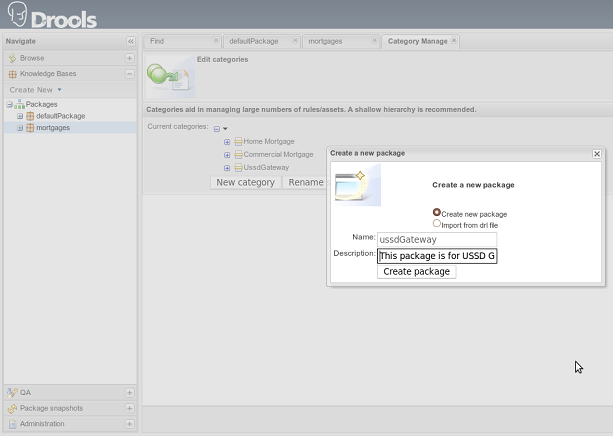

= Setup
:doctype: book
:sectnums:
:toc: left
:icons: font
:experimental:
:sourcedir: .

[[_preinstall_requirements_and_prerequisites]]
== Pre-Install Requirements and Prerequisites

Ensure that the following requirements have been met before continuing with the install.

=== Hardware Requirements

The Application doesn't change the {this-platform} JAIN SLEE Hardware Requirements, refer to {this-platform} JAIN SLEE documentation for more information.

[NOTE]
====
Note that application makes use of Resource Adaptors - this implies that s requirements must be taken into consideration!

Also be aware that each Resource Adaptor may have some specific hardware requirements!
====

=== Software Prerequisites

The Application requires {this-platform} JAIN SLEE properly set, with:

* Client

Resource Adaptors deployed.

NOTE: Note  Resource Adaptor - has some specific software requirements! Please refer to MAP RA document in JSLEE Guide

[[_source_code]]
== {this-platform}  JAIN SLEE {this-application}  Source Code

[[_release_source_building]]
=== Release Source Code Building

. Downloading the source code
+
IMPORTANT: GIT is used to manage its source code.
Instructions for using GIT, including install, can be found at http://git-scm.com/documentation
+
Use GIT to clone repository, the base URL is &THIS.TRUNK_SOURCE_CODE_URL;, then to checkout specific release version(tag) use `git checkout tag_name`, lets consider release-&THIS.VERSION;. 
+
[source]
----

[usr]$ git clone 
[usr]$ cd ussdgateway
[usr]$ git checkout release-
----

. Building the source code
+
IMPORTANT: Maven 2.0.9 (or higher) is used to build the release.
Instructions for using Maven2, including install, can be found at http://maven.apache.org
+
Use Maven to build the binary.
+
[source]
----

				    [usr]$ cd -
				    [usr]$ mvn install
----
+
Once the process finishes you should have the `-/core/bootstrap/target/{this-folder}-ussd-gateway` directory,  if {this-platform}  JAIN SLEE is installed and environment variable JBOSS_HOME is pointing to its underlying &JEE.PLATFORM; directory, then the  `{this-folder}-ussd-gateway` will also be  deployed in the container.

[[_trunk_source_building]]
=== Development Trunk Source Building

Similar process as for <<_release_source_building>>, the only change is don't switch to specific tag. 

[[_strucure]]
== Folder structure of {this-platform}  JAIN SLEE {this-application} 

Installing {this-platform} USSD Gateway creates a {this-folder}-ussd-gateway directory that contains gateway configuration,  libraries required for boot and running, example rules definition file (.drl) etc.
You need to know your way around  the distribution layout to locate the drools file's to add new rules.
The figure "view of Mobicens USSD Gateway"  illustrates the installation directory of the Gateway. 

image::images/mobicents-ussd-structure.png[]

[[_setup_rule]]
== Rule engine configuration

IMPORTANT: {this-application} uses `Drools` as rule engine to perform decisions, it is important to understand &THIS.JBOSS.DROOLS.DOCUMENTATION;link:[JBoss Drools] 

Engine is fed with `DRL` files having reference to fact. `DRL` file contains set of rules which perform operations on facts passed into engine. {this-application}  `DRL` file defines rules to match initial  string to set of values identifying protocol and address of peer to which messages should be forwarded. 

Fact is simple POJO class. {this-application} fact looks like 

[source,java]
----

package org.mobicents.ussdgateway.rules;

import java.io.Serializable;

/**
 * Acts as Fact for Rules
 * 
 */
public class Call implements Serializable {
	// Initial string, its like #123*
	private String ussdString;

	private boolean isHttp;
	private boolean isSmpp;

	// to be used with other protocols
	private String genericUrl;

	public Call(String ussdString) {
		this.ussdString = ussdString;
	}

	public String getUssdString() {
		return ussdString;
	}

	public boolean isHttp() {
		return isHttp;
	}

	public void setHttp(boolean isHttp) {
		this.isHttp = isHttp;
	}

	public boolean isSmpp() {
		return isSmpp;
	}

	public void setSmpp(boolean isSmpp) {
		this.isSmpp = isSmpp;
	}

	/**
	 * @return the genericUrl
	 */
	public String getGenericUrl() {
		return genericUrl;
	}

	/**
	 * @param genericUrl
	 *            the genericUrl to set
	 */
	public void setGenericUrl(String genericUrl) {
		this.genericUrl = genericUrl;
	}

	@Override
	public String toString() {
		return "Call [ussdString=" + ussdString + ", isHttp=" + isHttp + ", isSmpp=" + isSmpp + ", genericUrl="
				+ genericUrl + "]";
	}
	
}
----

Rule engine can be fed with static `.drl` file or use `Guvnor` to dynamically create and maintain `.drl`        

Rule engine (`Drools`) is configured with [path]_USSDGatewayChangeSet.xml_ file.
Its content alters how rule set is loaded and maintained within engine.
There are two ways of maintaining rules: 

locally::
  rules are loaded from designated file as explained in <<_setup_rule_local>>.
  Configuration file should look as follows:

remotely::
  rules are managed by `Guvnor`.
  Guvnor configuration is explpained in <<_setup_rule_guvnor>>  Configuration file should look as follows:

[[_setup_rule_local]]
== Local file configuration

Rule file name is [path]_USSDGateway.drl_.
File content looks as follows:

[source,java]
----

package org.mobicents.ussdgateway.rules

import org.mobicents.ussdgateway.rules.Call;

rule "USSDGateway1"
	
	when
		$c : Call( ussdString == "*123#" )
	then
		$c.setHttp( true );
		$c.setGenericUrl( "http://localhost:8080/ussddemo/test" );

end
----

The folder [path]_rules_ is scanned every 60 seconds and if any changes made to [path]_USSDGateway.drl_ or new `.drl` file added, engine will automatically deploy changed/new file and re-create the Knowledge Base 

[[_setup_rule_guvnor]]
== Guvnor configuration

IMPORTANT: {this-application} Application uses `Gunvor`				to manage system wide rule set in consistent way, it is important to understand &THIS.JBOSS.GUVNOR.DOCUMENTATION;link:[Guvnor]			

`Guvnor`			is deployed along with {this-application} 			Application.
To access it simply go to `http://<your server>/drools-guvnor/`			. This will bring initial info screen or login screen - depends on configuration. 

If you have not configured the security you can directly login without providing any user id or password.

[[_setup_rule_guvnor_initial]]
=== Creating resources

NOTE: `Guvnor` requires upload for fact model and creation of some resources before it can perform its tasks.

In case `Guvnor`				has not been used(it is a new repository) you will get a message asking if you would you like to install a sample repository? Its upto you to install the sample repository.
If you say yes, you would get sample repository which you can refer to have better understanding of Guvnor 

Once you log-in follow the bellow steps:

. Create a category specific to USSD gateway.
+
Go to menu:Administration > Category > New Category[]						. Enter Category name as `UssdGateway`						. 
+

image::images/USSD-Guvnor-createCategory.png[]

. Create package for fact model.
+
Rules need a fact model (object model) to work off, so next you will want to go to the Package management feature.
Go to menu:Knowledge Bases > Create New > New Package[]						. Type `ussdGateway`						(note that this name `MUST`						match package in [path]_USSDGatewayChangeSet.xml_						file). 
+

. Upload fact model.
+
To upload a model, use ussdgateway-domain-x.y.z.jar which has the fact model (Call.java API) that you will be using in your rules.
When you are in the model editor screen, you can upload a jar file, choose the package name from the list that you created in the previous step.
Go to menu:Knowledge Base > Create New > Upload POJO Model Jar
						[]						. On the screen enter name as `UssdPojo`						, select package `ussdGateway`						and add the description, click btn:[Ok]						. 
+

image::images/USSD-Guvnor-UploadModel.png[]
+
Browse in newly open window and point to [path]_${JBOSS.HOME}/server/default/deploy/{this-folder}-ussd-gateway/lib/ussdgateway-domain-x.y.z.jar for JBoss AS or ${JBOSS.HOME}/modules/system/layers/base/org/mobicents/ussd/bootstrap/main/ussdgateway-domain-x.y.z.jar for Wildfly 10
						_						. 

. Edit your package configuration.
+
Now edit your package configuration (you just created) to import the fact types you just uploaded (add import statements), and save the changes.
Go to Knowledge Bases and click on `ussdGateway`						package.
Click on btn:[Save and validate configuration]						button. 

This concludes configuration of `Guvnor`				. Note that this has to be done only once. 

[[_setup_rule_guvnor_creating_rules]]
=== Creating rules

`Guvnor` allows to create rules and edit previously existing ones.
Changes done with `Guvnor` are automaticly propagated to all clients.
To create rule follow procedure below:

. Create rule.
+
Go to menu:Knowledge Bases> Create New > New Rule[].
Enter Name as `ussd123Sip`, click on `UssdGateway` Initial Category.
Select btn:[DRL Rule (Technical rule - text editor)], actually you can use any editor here that you are comfortable with.
Select `ussdGateway` as package.
Enter description and click `Ok`.
+

image::images/USSD-Guvnor-NewRule.png[]

. Edit rule.
+

+

image::images/USSD-Guvnor-DRL.png[]

. Accept rule.
+
Click on btn:[Validate] to validate the Rules you just defined.
Once done with rule editing, you can check in the changes (save) by clicking on btn:[Save Changes]

. Rebuild and validate package
+
After you have edited some rules in btn:[ussdGateway] package, you can click on the btn:[ussdGateway] package, open the package, and build the whole package.
+

image::images/USSD-Guvnor-BuildPackage.png[]
